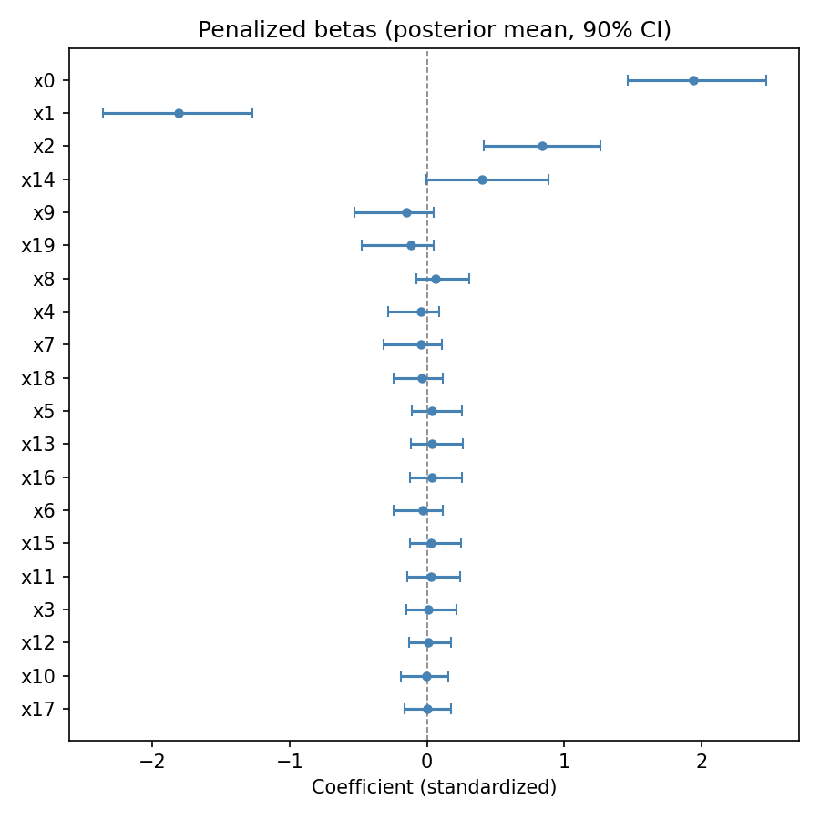
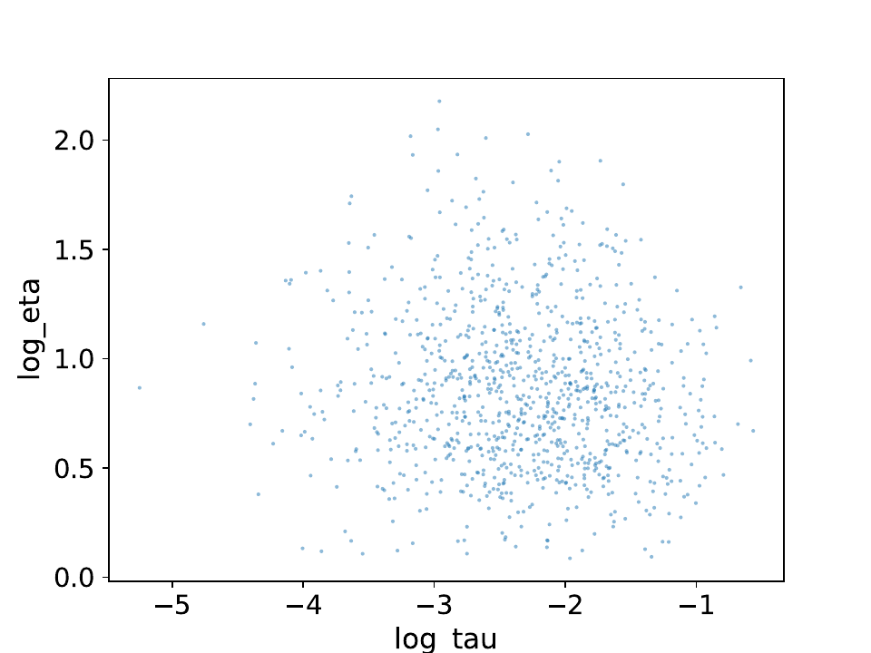
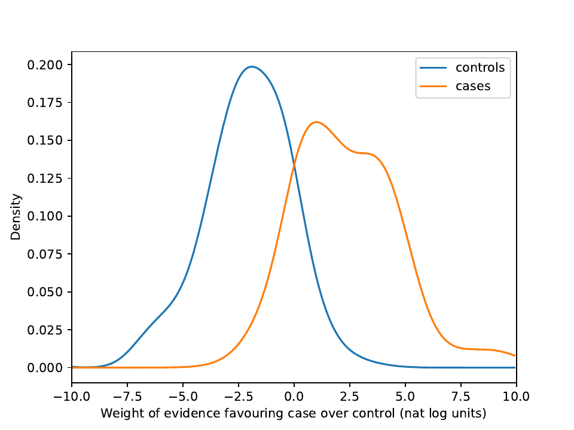
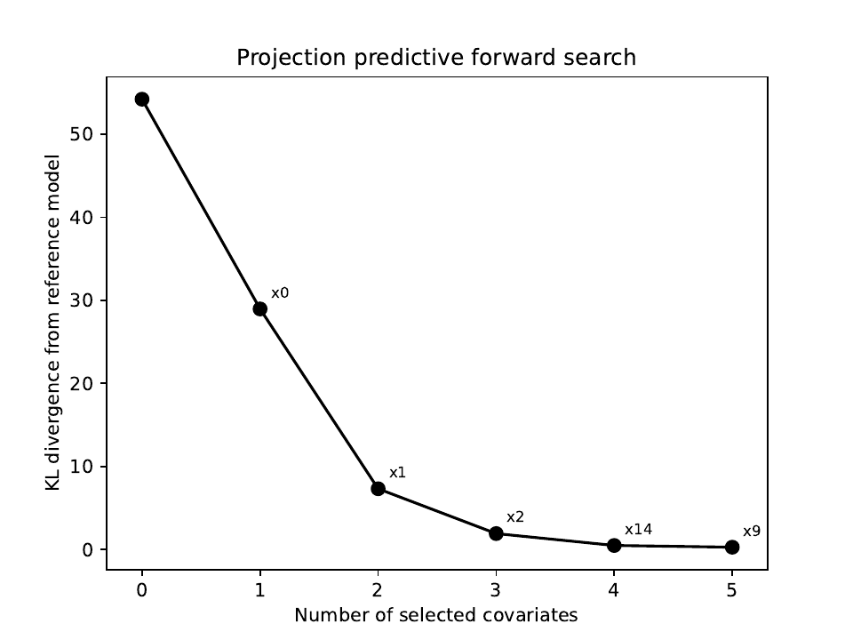
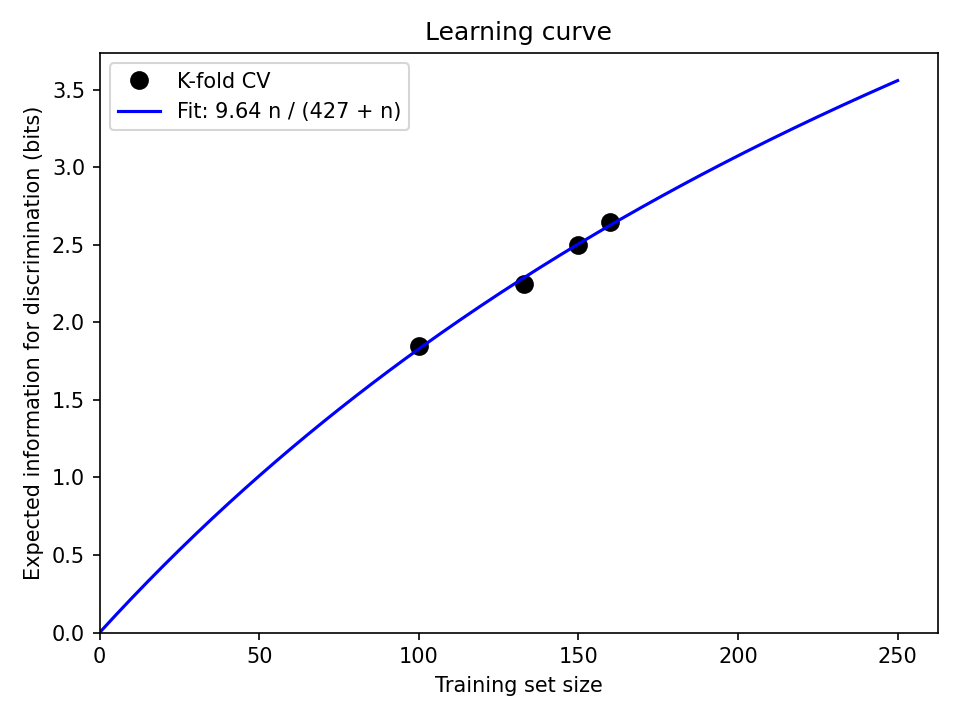

# hsnpyr

Regularized horseshoe logistic regression in NumPyro, with tools for
evaluation and variable selection.

## Features

- **Regularized horseshoe prior** (Piironen & Vehtari, 2017) with separate
  unpenalized and penalized covariate groups
- **Samplers**: NUTS (via NumPyro) and MCLMC (via BlackJAX)
- **Evaluation**: C-statistic, logarithmic score, weight of evidence
  densities, and expected information for discrimination (McKeigue, 2019)
- **K-fold cross-validation** with automatic memory-aware parallelism
- **Learning curves** with saturation model fit
- **Projection predictive forward search** (Piironen & Vehtari, 2020) for
  variable selection, with pre-screening and warm-starting for scalability
- Diagnostic plots: log(tau)--log(eta) pairs, weight of evidence densities,
  forest plot, learning curves, projpred KL path

## Installation

Requires Python 3.9+. Install directly from GitHub:

```
pip install git+https://github.com/pmckeigue/hsnpyr.git
```

This pulls all dependencies automatically.  For a development install
(editable, so local changes take effect immediately):

```
git clone https://github.com/pmckeigue/hsnpyr.git
pip install -e hsnpyr
```

## Quick start

`run_analysis` is the top-level entry point.  It takes a pandas DataFrame
and column names.  A typical workflow has two steps:

1. **Fit the full model** to obtain posterior summaries and variable
   selection (projpred).
2. **Cross-validate** to evaluate predictive performance on held-out data
   and plot the learning curve.

```python
import pandas as pd
import hsnpyr as hs

df = pd.read_csv("mydata.csv")

# Step 1: posterior summaries and projpred
out = hs.run_analysis(
    df,
    y_col="outcome",
    unpenalized_cols=["age", "sex"],   # intercept is added automatically
    penalized_cols=["gene1", "gene2", ..., "gene500"],
    filestem="my_analysis",
    p0=10,                             # prior guess: ~10 nonzero effects
    num_warmup=1000, num_samples=1000, num_chains=4,
    projpred_V=10,                     # select up to 10 variables
)

# Step 2: cross-validation
cv_out = hs.run_analysis(
    df,
    y_col="outcome",
    unpenalized_cols=["age", "sex"],
    penalized_cols=["gene1", "gene2", ..., "gene500"],
    filestem="my_analysis",
    p0=10,
    num_warmup=1000, num_samples=1000, num_chains=4,
    crossvalidate_=True,               # learning curve + 5-fold CV only
)
```

Step 1 writes a summary CSV, forest plot, diagnostic plots, and projpred
plot, and returns a dict with the fitted model, posterior summaries, and
variable selection results.

Step 2 runs only the learning curve (K=2..5) and 5-fold cross-validation,
skipping the full model fit.  It writes learning curve and CV weight of
evidence plots, and returns the CV results.

For direct control over the arrays, the lower-level functions are also
available:

```python
import jax.numpy as jnp

result = hs.fit(X_u, X, y, slab_scale=2.0, slab_df=4.0, scale_global=0.01)
probs = hs.predict(result, X_u_new, X_new, slab_scale=2.0, slab_df=4.0, scale_global=0.01)
selected, kl_path, kl_null = hs.projpred_forward_search(result, X_u, X, V=10)
cv = hs.crossvalidate(X_u, X, y, K=5, slab_scale=2.0, slab_df=4.0, scale_global=0.01)
```

## Example on simulated data

The following example uses `run_analysis` on a toy dataset: N=200
observations, J=20 penalized covariates of which 3 have true nonzero
effects (beta = +2.0, -1.5, +1.0), and an intercept of -0.5.

### Step 1: Posterior summaries and projpred

```python
import matplotlib
matplotlib.use("Agg")
import numpy as np
import pandas as pd
import hsnpyr as hs

np.random.seed(42)
N, J = 200, 20
beta_true = np.zeros(J)
beta_true[0], beta_true[1], beta_true[2] = 2.0, -1.5, 1.0
X = np.random.randn(N, J).astype(np.float32)
logits = -0.5 + X @ beta_true
y = np.random.binomial(1, 1.0 / (1.0 + np.exp(-logits))).astype(np.float32)

penalized_names = [f"x{j}" for j in range(J)]
data = {col: X[:, j] for j, col in enumerate(penalized_names)}
data["outcome"] = y
df = pd.DataFrame(data)

out = hs.run_analysis(
    df, y_col="outcome",
    unpenalized_cols=[],
    penalized_cols=penalized_names,
    filestem="demo",
    slab_scale=2.0, slab_df=4.0, p0=3,
    num_warmup=500, num_samples=500, num_chains=2,
    rng_seed=0, projpred_V=5,
)
```

#### Posterior summary

The summary CSV (`demo_summary.csv`) contains tau, eta, the intercept,
the top 5 penalized covariates by squared effect size, and m_eff
(effective number of nonzero coefficients):

| parameter | mean | q0.03 | q0.97 | n_eff | r_hat |
|---|---:|---:|---:|---:|---:|
| tau | 0.1230 | 0.0230 | 0.3447 | 441 | 1.003 |
| eta | 2.5431 | 1.2985 | 5.0621 | 519 | 1.003 |
| Intercept | -0.6349 | -1.0356 | -0.2295 | 1016 | 0.999 |
| x0 | 2.0450 | 1.4200 | 2.6893 | 1260 | 0.999 |
| x1 | -1.6948 | -2.3079 | -1.1237 | 900 | 1.000 |
| x2 | 0.7692 | 0.2870 | 1.2392 | 845 | 0.998 |
| x14 | 0.3699 | -0.0073 | 0.8711 | 321 | 1.005 |
| x9 | -0.1424 | -0.5753 | 0.0621 | 539 | 1.002 |
| m_eff | 2.5881 | 1.2855 | 4.3928 | 534 | 1.001 |

The three true signals (x0, x1, x2) are recovered with the largest
effect sizes.  The posterior mean of m_eff (2.59) is close to the true
number of nonzero coefficients (3).

#### In-sample diagnostics

```
In-sample (N=200):
  C-statistic                            = 0.920
  Expected information for discrimination = 3.13 bits
  Logarithmic score                      = -71.467
```

#### Forest plot

**Penalized betas** (posterior mean with 90% credible intervals):



The three true signals (x0, x1, x2) are clearly separated from zero,
while the noise covariates are shrunk towards zero by the horseshoe prior.

#### Diagnostic plots

**log(tau) vs log(eta) pairs** -- no divergences:



**Weight of evidence densities** -- separation between controls and cases:



#### Projection predictive variable selection

The projpred forward search selects the three true signals first, then
adds x14 and x9 (noise variables with small estimated effects):

```
Selected covariates (in order):
  1. x0 (index 0)
  2. x1 (index 1)
  3. x2 (index 2)
  4. x14 (index 14)
  5. x9 (index 9)
```



The KL divergence drops steeply for the first three variables and
flattens out, indicating that x0, x1, x2 capture nearly all the
predictive information.

### Step 2: Cross-validation

```python
cv_out = hs.run_analysis(
    df, y_col="outcome",
    unpenalized_cols=[],
    penalized_cols=penalized_names,
    filestem="demo",
    slab_scale=2.0, slab_df=4.0, p0=3,
    num_warmup=500, num_samples=500, num_chains=2,
    rng_seed=0, crossvalidate_=True,
)
```

This runs a learning curve (K=2..5) and 5-fold cross-validation.

#### Learning curve

The learning curve plots expected information for discrimination on
held-out data against training set size, with a fitted saturation model:



#### Predictive performance (5-fold CV)

```
5-fold cross-validation (N=200):
  C-statistic                            = 0.888
  Expected information for discrimination = 2.65 bits
  Logarithmic score                      = -81.234
```

The out-of-sample predictive performance is lower than the in-sample
metrics, as expected.  The learning curve shows that performance has
not yet saturated, indicating that more data would improve prediction.

## API

| Function | Description |
|---|---|
| `run_analysis` | High-level entry point from a DataFrame |
| `fit` | Fit horseshoe logistic regression (NUTS or MCLMC) |
| `predict` | Posterior predictive probabilities |
| `crossvalidate` | K-fold CV with parallel fold execution |
| `projpred_forward_search` | Projection predictive variable selection |
| `summary_report` | Parameter summary table (CSV) |
| `learning_curve` | Info for discrimination vs training size |
| `cstatistic` | Concordance statistic (AUC) |
| `log_score` | Logarithmic scoring rule |
| `Wdensities` | Weight of evidence density estimation |
| `wevid` | Kernel density weight of evidence |
| `get_info_discrim` | Expected information for discrimination |
| `recalibrate_probs` | Platt scaling recalibration |
| `plot_learning_curve` | Learning curve with fitted saturation model |
| `plot_pair_diagnostic` | log(tau)--log(eta) scatter with divergences |
| `plot_wevid` | Weight of evidence density plot |
| `plot_forest` | Forest plot of penalized betas with 90% CIs |
| `plot_projpred` | KL divergence path from projpred search |

## References

- McKeigue, P. (2019). Quantifying performance of a diagnostic test as the
  expected information for discrimination: Relation to the C-statistic.
  *Statistical Methods in Medical Research*, 28(6):1841-1851.
  doi: [10.1177/0962280218776989](https://doi.org/10.1177/0962280218776989).
- Piironen, J. and Vehtari, A. (2017). Sparsity information and regularization
  in the horseshoe and other shrinkage priors. *Electronic Journal of
  Statistics*, 11(2):5018-5051.
- Piironen, J. and Vehtari, A. (2020). Projective inference in
  high-dimensional problems: prediction and feature selection. *Electronic
  Journal of Statistics*, 14(1):2155-2197.
