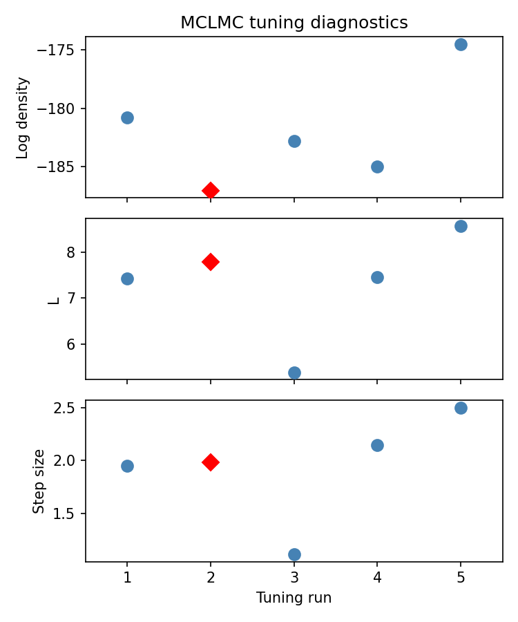
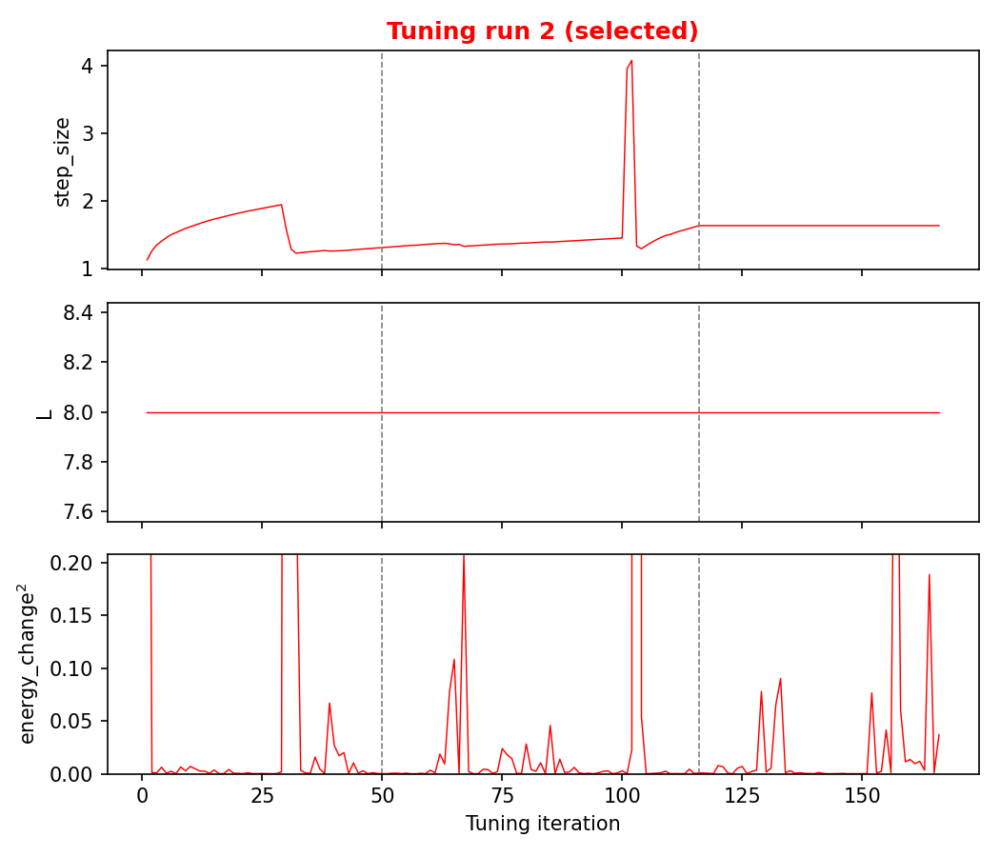
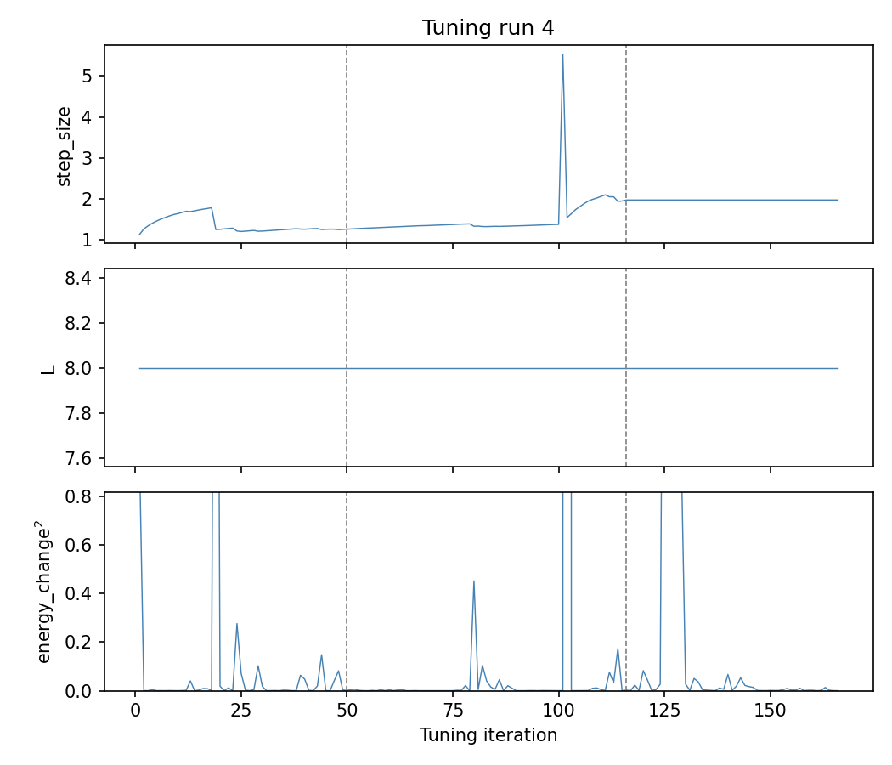

# hsnpyr

Regularized horseshoe logistic regression in NumPyro, with tools for
evaluation and variable selection.  A typical use for this module is to learn to predict disease status from a high-dimensional panel of biomarkers. 

## Features

- **Regularized horseshoe prior** (Piironen & Vehtari, 2017) with separate
  unpenalized and penalized covariate groups
- **Samplers**: No-U-turn sampler (NUTS) via NumPyro and microcanonical Langevin Monte Carlo (MCLMC) via BlackJAX.  The MCLMC sampler is faster than NUTS for high-dimensional datasets, but is still experimental.  
- **Evaluation**: C-statistic, logarithmic score, weight of evidence
  densities, and expected information for discrimination (McKeigue, 2019)
- **K-fold cross-validation** with automatic memory-aware parallelism
- **Learning curves** with saturation model fit
- **Projection predictive forward search** (Piironen & Vehtari, 2020) for
  variable selection, with pre-screening and warm-starting for scalability
- Diagnostic plots: log(tau)--log(eta) pairs, weight of evidence densities,
  forest plot, learning curves, projpred KL path

## Installation

Requires Python 3.9+. Install directly from GitHub:

```
pip install git+https://github.com/pmckeigue/hsnpyr.git
```

This pulls all dependencies automatically.  For a development install
(editable, so local changes take effect immediately):

```
git clone https://github.com/pmckeigue/hsnpyr.git
pip install -e hsnpyr
```

## Quick start

`run_analysis` is the top-level entry point.  It takes a pandas DataFrame
and column names.  A typical workflow has two steps:

1. **Fit the full model** to obtain posterior summaries and variable
   selection (projpred).
2. **Cross-validate** to evaluate predictive performance on held-out data
   and plot the learning curve.

```python
import pandas as pd
import hsnpyr as hs

df = pd.read_csv("mydata.csv")

# Step 1: posterior summaries and projpred
out = hs.run_analysis(
    df,
    y_col="outcome",
    unpenalized_cols=["age", "sex"],   # intercept is added automatically
    penalized_cols=["gene1", "gene2", ..., "gene500"],
    filestem="my_analysis",
    p0=10,                             # prior guess: ~10 nonzero effects
    num_warmup=1000, num_samples=1000, num_chains=4,
    projpred_V=10,                     # select up to 10 variables
)

# Step 2: cross-validation
cv_out = hs.run_analysis(
    df,
    y_col="outcome",
    unpenalized_cols=["age", "sex"],
    penalized_cols=["gene1", "gene2", ..., "gene500"],
    filestem="my_analysis",
    p0=10,
    num_warmup=1000, num_samples=1000, num_chains=4,
    crossvalidate_=True,               # learning curve + 5-fold CV only
)
```

Step 1 writes a summary CSV, forest plot, diagnostic plots, and projpred
plot, and returns a dict with the fitted model, posterior summaries, and
variable selection results.

Step 2 runs only the learning curve (K=2..5) and 5-fold cross-validation,
skipping the full model fit.  It writes learning curve and CV weight of
evidence plots, and returns the CV results.

### Using MCLMC

The MCLMC sampler (via BlackJAX) is faster than NUTS for
high-dimensional datasets.  Pass `sampler="mclmc"` to `fit()` or
`run_analysis()`.

```python
# Direct fit
result = hs.fit(X_u, X, y, slab_scale=2.0, slab_df=4.0,
                scale_global=0.01, sampler="mclmc")

# Via run_analysis
out = hs.run_analysis(df, y_col="outcome", ..., sampler="mclmc")
```

**Defaults for MCLMC** (when `num_samples` and `thin` are not
specified): 50,000 samples per chain with thinning factor 5, yielding
10,000 retained samples per chain.  NUTS defaults remain 1,000 samples
with no thinning.

**Robust tuning**: MCLMC runs 5 tuning attempts and selects the median
step size from valid runs.  This guards against occasional
degenerate tuning results (NaN or extreme step sizes).  Use
`plot_mclmc_tuning(result, filestem)` to inspect the tuning
diagnostics.

For direct control over the arrays, the lower-level functions are also
available:

```python
import jax.numpy as jnp

result = hs.fit(X_u, X, y, slab_scale=2.0, slab_df=4.0, scale_global=0.01)
probs = hs.predict(result, X_u_new, X_new, slab_scale=2.0, slab_df=4.0, scale_global=0.01)
selected, kl_path, kl_null = hs.projpred_forward_search(result, X_u, X, V=10)
cv = hs.crossvalidate(X_u, X, y, K=5, slab_scale=2.0, slab_df=4.0, scale_global=0.01)
```

## Example on simulated data

The following example uses `run_analysis` on a toy dataset: N=200
observations, J=20 penalized covariates of which 3 have true nonzero
effects (beta = +2.0, -1.5, +1.0), and an intercept of -0.5.

### Step 1: Posterior summaries and projpred

```python
import matplotlib
matplotlib.use("Agg")
import numpy as np
import pandas as pd
import hsnpyr as hs

np.random.seed(42)
N, J = 200, 20
beta_true = np.zeros(J)
beta_true[0], beta_true[1], beta_true[2] = 2.0, -1.5, 1.0
X = np.random.randn(N, J).astype(np.float32)
logits = -0.5 + X @ beta_true
y = np.random.binomial(1, 1.0 / (1.0 + np.exp(-logits))).astype(np.float32)

penalized_names = [f"x{j}" for j in range(J)]
data = {col: X[:, j] for j, col in enumerate(penalized_names)}
data["outcome"] = y
df = pd.DataFrame(data)

out = hs.run_analysis(
    df, y_col="outcome",
    unpenalized_cols=[],
    penalized_cols=penalized_names,
    filestem="demo",
    slab_scale=2.0, slab_df=4.0, p0=3,
    num_warmup=500, num_samples=500, num_chains=2,
    rng_seed=0, projpred_V=5,
)
```

#### Posterior summary

The summary CSV (`demo_summary.csv`) contains posterior summaries for: 

* the global shrinkage parameter (tau)
* the slab width (eta).  
* the effective number of nonzero coefficients (m_eff)
* the intercept of the regression model
* the coefficients for the top 5 penalized covariates by squared effect size with their
shrinkage factors (kappa).

A shrinkage factor of 1 indicates complete shrinkage: the coefficient will be close to zero.  With a regularized horseshoe prior, even the largest coefficients are regularized by a Gaussian prior with  mean zero and scale eta, so the shrinkage factor can never be close to zero unless the sample size is large enough for the likelihood to overwhelm this prior.  

| parameter | kappa | mean | q0.03 | q0.97 | n_eff | r_hat |
|---|---:|---:|---:|---:|---:|---:|
| tau | | 0.1270 | 0.0293 | 0.3431 | 341 | 1.001 |
| eta | | 2.5491 | 1.3315 | 4.9484 | 512 | 1.003 |
| m_eff | | 2.6120 | 1.4180 | 4.5643 | 533 | 1.002 |
| Intercept | | -0.5393 | -0.9367 | -0.1590 | 1312 | 0.999 |
| x0 | 0.3393 | 1.9396 | 1.3800 | 2.5644 | 870 | 1.000 |
| x1 | 0.3675 | -1.7760 | -2.4235 | -1.1970 | 830 | 1.003 |
| x2 | 0.6231 | 0.8217 | 0.3026 | 1.2850 | 693 | 1.000 |
| x14 | 0.8098 | 0.3825 | -0.0171 | 0.9235 | 382 | 1.001 |
| x9 | 0.9239 | -0.1332 | -0.5503 | 0.0923 | 615 | 0.999 |

The three true signals (x0, x1, x2) are recovered with the largest
effect sizes.  The posterior mean of m_eff is close to the true
number of nonzero coefficients (3).

#### In-sample diagnostics

```
In-sample (N=200):
  C-statistic                            = 0.920
  Expected information for discrimination = 3.13 bits
  Logarithmic score                      = -71.467
```

#### Forest plot

**Penalized betas** (posterior mean with 90% credible intervals):


The three true signals (x0, x1, x2) are clearly separated from zero,
while the noise covariates are shrunk towards zero by the horseshoe prior.

#### Diagnostic plots

**log(tau) vs log(eta) pairs** -- no divergences:


**Weight of evidence densities** -- separation between controls and cases:


#### Projection predictive variable selection

The projpred forward search selects the three true signals first, then
adds x14 and x9 (noise variables with small estimated effects):

```
Selected covariates (in order):
  1. x0 (index 0)
  2. x1 (index 1)
  3. x2 (index 2)
  4. x14 (index 14)
  5. x9 (index 9)
```


The KL divergence drops steeply for the first three variables and
flattens out, indicating that x0, x1, x2 capture nearly all the
predictive information.

### Step 2: Cross-validation

```python
cv_out = hs.run_analysis(
    df, y_col="outcome",
    unpenalized_cols=[],
    penalized_cols=penalized_names,
    filestem="demo",
    slab_scale=2.0, slab_df=4.0, p0=3,
    num_warmup=500, num_samples=500, num_chains=2,
    rng_seed=0, crossvalidate_=True,
)
```

This runs a learning curve (K=2..5) and 5-fold cross-validation.

#### Learning curve

The learning curve plots expected information for discrimination on
held-out data against training set size, with a fitted saturation model:


#### Predictive performance (5-fold CV)

```
5-fold cross-validation (N=200):
  C-statistic                            = 0.888
  Expected information for discrimination = 2.65 bits
  Logarithmic score                      = -81.234
```

The out-of-sample predictive performance is lower than the in-sample
metrics, as expected.  The learning curve shows that performance has
not yet saturated, indicating that more data would improve prediction.

### Step 3: MCLMC sampler

The same simulated dataset can be fitted with MCLMC instead of NUTS:

```python
out_mclmc = hs.run_analysis(
    df, y_col="outcome",
    unpenalized_cols=[],
    penalized_cols=penalized_names,
    filestem="demo_mclmc",
    slab_scale=2.0, slab_df=4.0, p0=3,
    num_warmup=500, num_samples=10_000, num_chains=2,
    rng_seed=0, sampler="mclmc",
)
```

MCLMC produces posterior estimates consistent with NUTS:

```
  run 1: L=7.427, step_size=1.9500, logdensity=-180.78 [OK]
  run 2: L=7.783, step_size=1.9849, logdensity=-187.05 [OK]
  run 3: L=5.386, step_size=1.1200, logdensity=-182.80 [OK]
  run 4: L=7.457, step_size=2.1460, logdensity=-184.99 [OK]
  run 5: L=8.568, step_size=2.4978, logdensity=-174.48 [OK]
MCLMC: selected run 2 — L=7.783, step_size=1.9849
```

#### MCLMC tuning diagnostics

The summary plot shows the final tuned values across the 5 tuning runs.
The selected run (median step size) is marked with a red diamond:



#### Tuning trace plots

The per-iteration trace plots show step_size and energy_change^2
through BlackJAX's 3-stage tuning.  Vertical dashed lines mark
stage boundaries.

**Selected run (run 2):**



**Run 4 (larger final step size):**



#### Interpretation

BlackJAX's MCLMC tuning has three stages, visible between the dashed
lines:

1. **Stage 1** (iterations 1--50): step-size adaptation without
   preconditioning.  The step size converges from its initial value
   of sqrt(dim)/4 towards a stable value around 1.3--1.8.  Energy
   variance shows frequent spikes as the integrator explores the
   unconditioned geometry.

2. **Stage 2** (iterations 50--150): the diagonal preconditioner
   (mass matrix) is computed from the position variances accumulated
   in stage 1, and the step size is readjusted.  A sharp spike in
   step_size appears around iteration 100 when the new preconditioner
   suddenly changes the effective geometry.  We use a longer
   readjustment sub-stage than the BlackJAX default (`num_steps2`
   iterations instead of `num_steps2 // 3`), which gives the step
   size enough iterations to converge to a stable plateau before
   stage 3 begins.

3. **Stage 3** (iterations 150 onwards): step size is fixed, and L
   (trajectory length) is set from the effective sample size of a
   short sampling run.

**energy_change^2** (the energy variance proxy) is spiky throughout,
reflecting the heavy-tailed geometry of the horseshoe posterior.  The
target energy variance is `dim * desired_energy_var` = 64 * 5e-4 =
0.032.  The y-axis is cropped to twice the 95th percentile to make the
overall trend visible despite large spikes.

With the longer readjustment, the middle three runs converge to step
sizes of 1.95, 1.98, and 2.15 -- much tighter than the 1.45--2.45
spread with the BlackJAX default of `num_steps2 // 3`.  Run 3 remains
an outlier (step_size=1.12) but the median selection discards it.

## API

| Function | Description |
|---|---|
| `run_analysis` | High-level entry point from a DataFrame |
| `fit` | Fit horseshoe logistic regression (NUTS or MCLMC) |
| `predict` | Posterior predictive probabilities |
| `crossvalidate` | K-fold CV with parallel fold execution |
| `projpred_forward_search` | Projection predictive variable selection |
| `summary_report` | Parameter summary table (CSV) |
| `learning_curve` | Info for discrimination vs training size |
| `cstatistic` | Concordance statistic (AUC) |
| `log_score` | Logarithmic scoring rule |
| `Wdensities` | Weight of evidence density estimation |
| `wevid` | Kernel density weight of evidence |
| `get_info_discrim` | Expected information for discrimination |
| `recalibrate_probs` | Platt scaling recalibration |
| `plot_learning_curve` | Learning curve with fitted saturation model |
| `plot_pair_diagnostic` | log(tau)--log(eta) scatter with divergences |
| `plot_wevid` | Weight of evidence density plot |
| `plot_forest` | Forest plot of penalized betas with 90% CIs |
| `plot_mclmc_tuning` | MCLMC parallel tuning diagnostic plot |
| `plot_mclmc_tuning_traces` | Per-run tuning trace plots (step_size, L, energy variance) |
| `plot_projpred` | KL divergence path from projpred search |

## References

- McKeigue, P. (2019). Quantifying performance of a diagnostic test as the
  expected information for discrimination: Relation to the C-statistic.
  *Statistical Methods in Medical Research*, 28(6):1841-1851.
  doi: [10.1177/0962280218776989](https://doi.org/10.1177/0962280218776989).
- Piironen, J. and Vehtari, A. (2017). Sparsity information and regularization
  in the horseshoe and other shrinkage priors. *Electronic Journal of
  Statistics*, 11(2):5018-5051.
- Piironen, J. and Vehtari, A. (2020). Projective inference in
  high-dimensional problems: prediction and feature selection. *Electronic
  Journal of Statistics*, 14(1):2155-2197.
